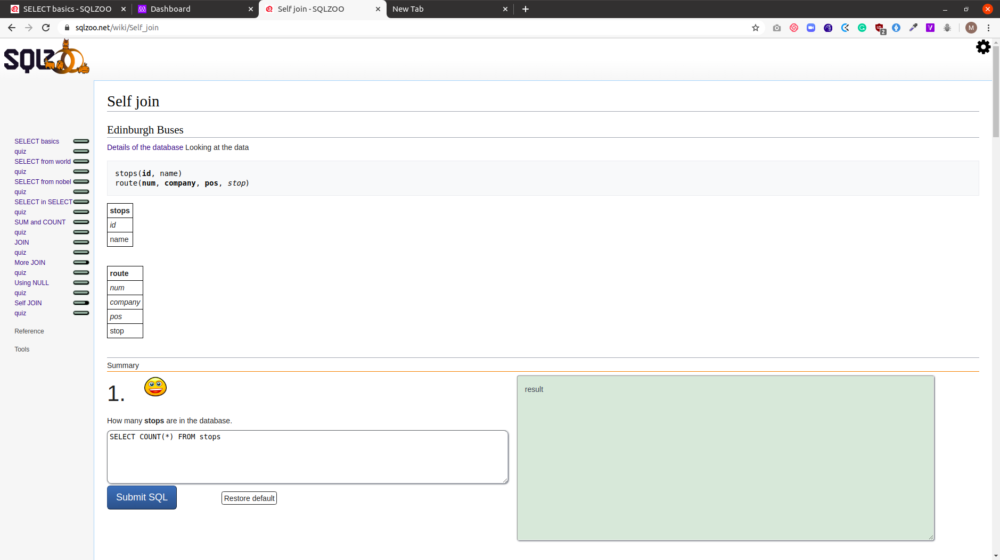

# databases-sqlzoo

This is a project of the Databases course in the Main curriculum at [Microverse](https:www.microverse.org/) - @microverseinc.

# Databases: SQL Project  ([The Odin Project](https://www.theodinproject.com/courses/databases/lessons/sql))

## Built With

- MySQL

## Description

- This repository contains answers to the tutorials 0-9 on [SqlZoo](https://sqlzoo.net/wiki/SQL_Tutorial)
- This project is mainly about using queries to access information from a MySQL database .
- The answers are grouped by the following tutorials
    - [SELECT basics](https://sqlzoo.net/wiki/SELECT_basics)
    - [SELECT names](https://sqlzoo.net/wiki/SELECT_names)
    - [SELECT FROM world](https://sqlzoo.net/wiki/SELECT_from_WORLD_Tutorial)
    - [SELECT FROM nobel](https://sqlzoo.net/wiki/SELECT_from_Nobel_Tutorial)
    - [SELECT in SELECT (Sub Queries)](https://sqlzoo.net/wiki/SELECT_within_SELECT_Tutorial)
    - [SUM & COUNT](https://sqlzoo.net/wiki/SUM_and_COUNT)
    - [JOIN](https://sqlzoo.net/wiki/The_JOIN_operation)
    - [More JOIN](https://sqlzoo.net/wiki/More_JOIN_operations)
    - [Using NULL](https://sqlzoo.net/wiki/Using_Null)
    - [Self JOIN](https://sqlzoo.net/wiki/Self_join)

## Live Demo

The answers can be checked by running the queries for the related tutorials on [SqlZoo](https://sqlzoo.net/wiki/SQL_Tutorial)

## Authors

👤 **Marylene Sawyer**
- Github: [@Bluette1](https://github.com/Bluette1)
- Twitter: [@MaryleneSawyer](https://twitter.com/MaryleneSawyer)
- Linkedin: [Marylene Sawyer](https://www.linkedin.com/in/marylene-sawyer-b4ba1295/)

## 📝 License

This project is [MIT](https://opensource.org/licenses/MIT) licensed.
